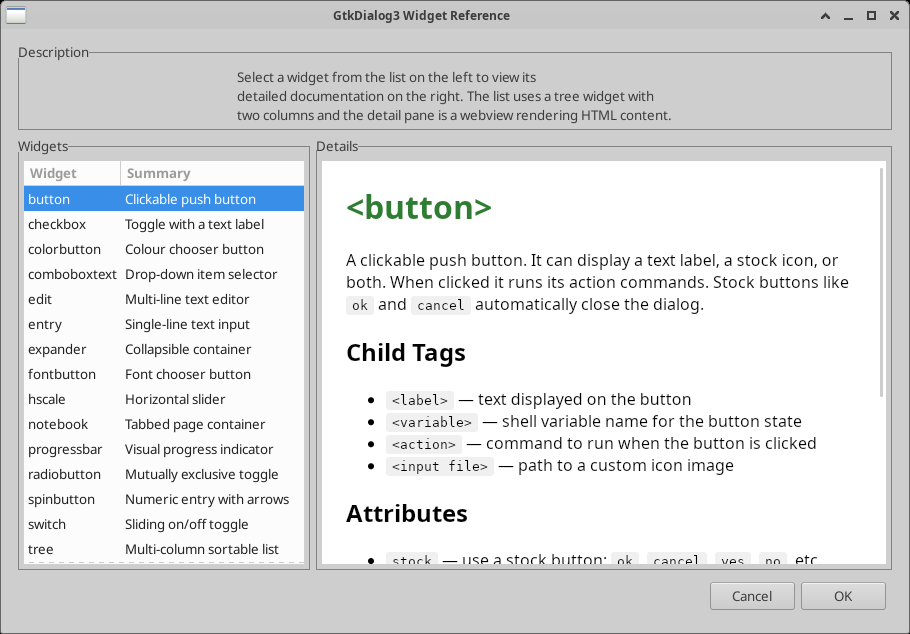
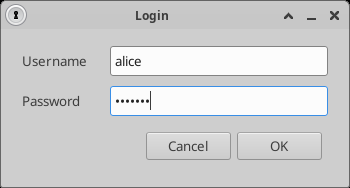

# GtkDialog3

> A small utility for fast and easy GUI building.


**GtkDialog3** builds GTK 3 graphical user interfaces *declaratively*. You
describe the interface in a small XML-like markup language — embedded straight
into a shell script or kept in a standalone file — and GtkDialog3 creates the
live GTK widgets at runtime, exporting widget values back to your script as
shell variables.

## 💜 Sponsor this project

GtkDialog3 is free and open source, developed and maintained in my spare time.
If it is useful to you or your organisation, please consider
**[sponsoring its development](https://github.com/sponsors/laszlopere)**. Your
support directly funds new widgets, bug fixes, and documentation — and sponsor
feature requests carry extra weight. Every contribution, large or small, is
hugely appreciated. 🙏

## Who is it for?

GtkDialog3 is for people who want a clean, native graphical interface but
**don't want to become a GUI developer**. If you can write a shell script, you
can build a real GTK application — no C, no event loops, no toolkit
boilerplate. It is a great fit for sysadmins, packagers, hobbyists, and anyone
who needs to put a friendly face on a script.

## Why GtkDialog3?

- **Flexible — build almost anything.** Compose 30+ widgets into windows of any
  layout, from a one-line prompt to a full multi-pane application.
- **Easy and quick.** Describe the UI in simple, readable markup; there is no UI
  to compile and no callbacks to wire up by hand.
- **Shell-script friendly.** Embed the markup right in bash. Widget values come
  back to you as ordinary shell variables, and actions run shell commands.
- **Simple.** A small, focused tool with a gentle learning curve.
- **Lots of widgets and options.** Buttons, lists, trees, notebooks, menus,
  scales, entries — plus optional terminals, source editors, and web views —
  each with many attributes to tune.
- **Well documented.** A complete widget reference plus a worked example for
  every widget.

## Screenshots

<table>
  <tr>
    <td align="center" valign="top">
      <br>
      <sub><b>&lt;tree&gt; + &lt;webview&gt;</b> — a widget-reference browser: a
      list on the left, WebKit-rendered HTML on the right.</sub>
    </td>
    <td align="center" valign="top">
      <br>
      <sub><b>&lt;sourceview&gt;</b> — syntax-highlighted source with
      language switching (GtkSourceView).</sub>
    </td>
  </tr>
  <tr>
    <td align="center" valign="top">
      <br>
      <sub><b>&lt;terminal&gt;</b> — an embedded shell with shortcut
      buttons (VTE).</sub>
    </td>
    <td align="center" valign="top">
      <br>
      <sub><b>&lt;switch&gt;</b> — sliding on/off toggles (core GTK 3).</sub>
    </td>
  </tr>
</table>

## Installing

### Dependencies

**Required**

| Dependency | pkg-config / package | Purpose |
|------------|----------------------|---------|
| GTK 3 (>= 3.0) | `gtk+-3.0` / `libgtk-3-dev` | The GUI toolkit |
| C toolchain | `gcc`, `make` | Compiling |
| flex, bison | `flex`, `bison` | Lexer / parser |
| autotools (git build only) | `autoconf`, `automake`, `pkg-config` | Generating `configure` |

**Optional** — each is auto-detected by `configure`; if missing, the
corresponding widget is simply compiled out.

| Dependency | pkg-config / package | Enables |
|------------|----------------------|---------|
| VTE | `vte-2.91 >= 0.38` / `libvte-2.91-dev` | `<terminal>` — embedded terminal |
| WebKitGTK | `webkit2gtk-4.1` / `libwebkit2gtk-4.1-dev` | `<webview>` — HTML rendering |
| GtkSourceView | `gtksourceview-4` / `libgtksourceview-4-dev` | `<sourceview>` — syntax-highlighted editor |

On Debian/Ubuntu you can install everything with:

```sh
sudo apt install build-essential flex bison pkg-config autoconf automake \
    libgtk-3-dev libvte-2.91-dev libwebkit2gtk-4.1-dev libgtksourceview-4-dev
```

### From a release tarball

```sh
./configure
make
sudo make install
```

### From Git

```sh
./autogen.sh
make
sudo make install
```

`configure` prints which optional features it enabled; if a library is not
found, that widget is left out and the rest still builds.

## Documentation & examples

- 📖 **[User Manual (PDF)](doc/gtkdialog.pdf)** — the full reference manual,
  click to read it online.
- **Widget reference:** `doc/reference/` (HTML).
- **Examples:** `examples/` — one folder per widget, plus larger sample
  applications (`pfeme`, `pfontview`, `playmusic`).

These are not installed by default, so copy them somewhere if you want them
around. Older Glade-generated interfaces are still loadable, but building new
GtkDialog3 apps that way is not recommended.

## Building dialogs with an AI assistant

If you use an AI coding assistant — such as
[Claude Code](https://claude.com/claude-code), Anthropic's command-line tool —
this repository ships a ready-made knowledge pack in
**[`for-claude/`](for-claude/)** that turns the assistant into a GtkDialog3
expert. It can then write, fix, and explain dialogs for you, so you can describe
what you want ("a form with a name field and OK/Cancel") instead of learning the
markup yourself.

The pack is distilled from this project's manual, the per-widget reference, the
examples, and the source code — including the non-obvious quirks — and every
example in it was run and verified.

### Example: one line in, a dialog out

With the skill installed, just describe what you want at the Claude Code prompt:

```text
> Using the gtkdialog3 skill, build a login dialog with a username field,
  a password field, and OK/Cancel buttons, then run it.
```

The assistant reads the skill, writes a runnable shell script, and launches it —
you don't touch the markup:

<p align="center">
  
</p>

The generated script is in
[`for-claude/examples/login-dialog/`](for-claude/examples/login-dialog/). For a
bigger, agent-driven build, see
[`for-claude/examples/system-dashboard/`](for-claude/examples/system-dashboard/).

**How to use it:**

- **The easy way (recommended):** copy the skill into your project so the
  assistant picks it up automatically whenever you ask it to build a dialog:

  ```sh
  cp -r for-claude/skills/gtkdialog3 your-project/.claude/skills/
  ```

  Use `~/.claude/skills/` instead to make it available in every project. Then
  just ask, e.g. *"build a GtkDialog3 password prompt and read the value back."*

- **Without installing:** if the `for-claude/` folder is just sitting in your
  project (for example, when you are working inside this repository), point the
  assistant at it in your request. At the Claude Code prompt:

  ```text
  > Read for-claude/skills/gtkdialog3/SKILL.md and the reference/ files next to
    it, then build a login dialog with a username field, a password field, and
    OK/Cancel buttons, and run it.
  ```

  The assistant opens the files itself before building. You can also `@`-mention
  [`for-claude/skills/gtkdialog3/SKILL.md`](for-claude/skills/gtkdialog3/SKILL.md)
  to pull it into the chat, or just paste a section in and ask your question.

You don't need to be an AI expert: the files are also plain, readable Markdown,
so they double as a quick-start cheat sheet even if you never use an assistant.
See [`for-claude/README.md`](for-claude/README.md) for the full details.

## Platform notes

**ARM** — a widget packing-order issue on ARM is worked around with an
`#ifdef __arm__` block in `src/automaton.c`.

## License

GtkDialog3 is free software, released under the **GNU General Public License,
version 2 or later**. See [`COPYING`](COPYING) for the full text.

```
Copyright (C) 2003-2026  László Pere   <laszlopere@gmail.com>
Copyright (C) 2011-2012  Thunor        <thunorsif@hotmail.com>
```

## Download the source

The current, maintained source lives on GitHub:

```sh
git clone https://github.com/laszlopere/gtkdialog3.git
```

Release tarballs are on the
[Releases](https://github.com/laszlopere/gtkdialog3/releases) page.

The original (no longer maintained) project was hosted at
<http://code.google.com/p/gtkdialog/>.

## Contact

Maintainer: **László Pere** — <laszlopere@gmail.com>
