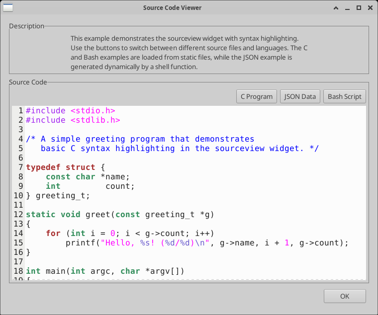
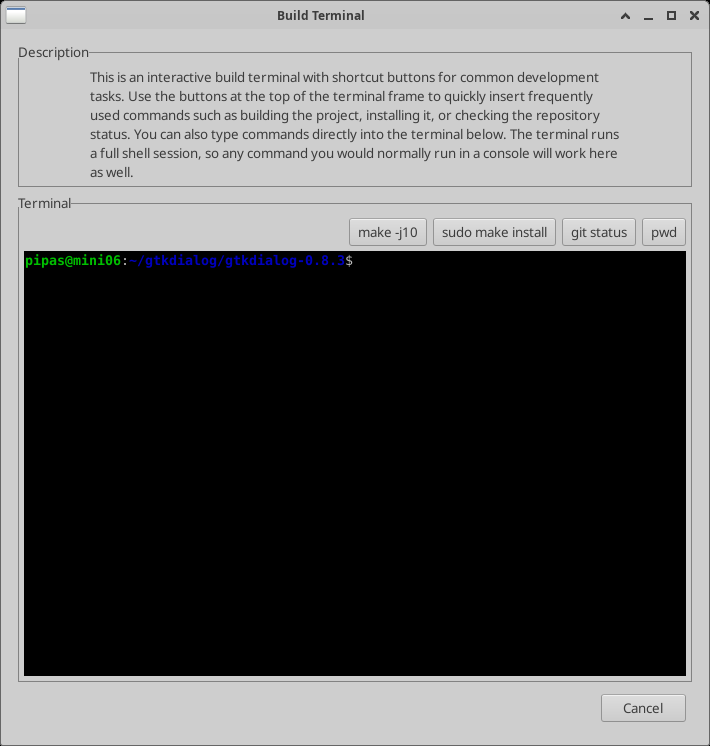
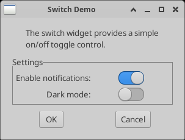

# GtkDialog3

> A small utility for fast and easy GUI building.


**GtkDialog3** builds GTK 3 graphical user interfaces *declaratively*. You
describe the interface in a small XML-like markup language — embedded straight
into a shell script or kept in a standalone file — and GtkDialog3 parses it and
creates the live GTK widgets at runtime, exporting widget values back to your
script as shell variables. It is ideal for giving quick, native dialogs and
front-ends to bash scripts without writing any C.

This is a fork of the original **Gtkdialog** by Pere László (*pipas*), which was
maintained by *Thunor* from 2011 to 2013. Development continues here under the
name GtkDialog3, ported to GTK 3 with new widgets and fixes.

## Screenshots

<table>
  <tr>
    <td align="center" valign="top">
      <br>
      <sub><b>&lt;tree&gt; + &lt;webview&gt;</b> — a widget-reference browser: a
      list on the left, WebKit-rendered HTML on the right.</sub>
    </td>
    <td align="center" valign="top">
      <br>
      <sub><b>&lt;sourceview&gt;</b> — syntax-highlighted source with
      language switching (GtkSourceView).</sub>
    </td>
  </tr>
  <tr>
    <td align="center" valign="top">
      <br>
      <sub><b>&lt;terminal&gt;</b> — an embedded shell with shortcut
      buttons (VTE).</sub>
    </td>
    <td align="center" valign="top">
      <br>
      <sub><b>&lt;switch&gt;</b> — sliding on/off toggles (core GTK 3).</sub>
    </td>
  </tr>
</table>

## Features

- Declarative, XML-like markup — no C required.
- 30+ widgets: windows, boxes, buttons, entries, lists, trees, notebooks,
  menus, scales, and more.
- Embed the markup directly in bash, or load it from a file.
- Widget values are exported back to the calling script as shell variables.
- Signal/action handlers run shell commands, refresh widgets, launch dialogs.
- Optional rich widgets when their libraries are present (see below).

## Installing

### Dependencies

**Required**

| Dependency | pkg-config / package | Purpose |
|------------|----------------------|---------|
| GTK 3 (>= 3.0) | `gtk+-3.0` / `libgtk-3-dev` | The GUI toolkit |
| C toolchain | `gcc`, `make` | Compiling |
| flex, bison | `flex`, `bison` | Lexer / parser |
| autotools (git build only) | `autoconf`, `automake`, `pkg-config` | Generating `configure` |

**Optional** — each is auto-detected by `configure`; if missing, the
corresponding widget is simply compiled out.

| Dependency | pkg-config / package | Enables |
|------------|----------------------|---------|
| VTE | `vte-2.91 >= 0.38` / `libvte-2.91-dev` | `<terminal>` — embedded terminal |
| WebKitGTK | `webkit2gtk-4.1` / `libwebkit2gtk-4.1-dev` | `<webview>` — HTML rendering |
| GtkSourceView | `gtksourceview-4` / `libgtksourceview-4-dev` | `<sourceview>` — syntax-highlighted editor |

On Debian/Ubuntu you can install everything with:

```sh
sudo apt install build-essential flex bison pkg-config autoconf automake \
    libgtk-3-dev libvte-2.91-dev libwebkit2gtk-4.1-dev libgtksourceview-4-dev
```

### From a release tarball

```sh
./configure
make
sudo make install
```

### From Git

```sh
./autogen.sh
make
sudo make install
```

`configure` prints which optional features it enabled; if a library is not
found, that widget is left out and the rest still builds.

## Documentation & examples

- **Widget reference:** `doc/reference/` (HTML).
- **Examples:** `examples/` — one folder per widget, plus larger sample
  applications (`pfeme`, `pfontview`, `playmusic`).

These are not installed by default, so copy them somewhere if you want them
around. Older Glade-generated interfaces are still loadable, but building new
GtkDialog3 apps that way is not recommended.

## Platform notes

**ARM** — a widget packing-order issue on ARM is worked around with an
`#ifdef __arm__` block in `src/automaton.c`.

## License

GtkDialog3 is free software, released under the **GNU General Public License,
version 2 or later**. See [`COPYING`](COPYING) for the full text.

```
Copyright (C) 2003-2026  László Pere   <laszlopere@gmail.com>
Copyright (C) 2011-2012  Thunor        <thunorsif@hotmail.com>
```

## Contact

Maintainer: **László Pere** — <laszlopere@gmail.com>

The original (no longer maintained) project lived at
<http://code.google.com/p/gtkdialog/>.
